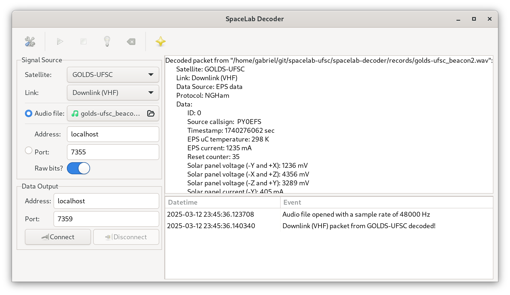

<h1 align="center">
    SPACELAB-DECODER
    <br>
</h1>

<h4 align="center">Packet decoder of the SpaceLab's satellites.</h4>

<p align="center">
    <a href="https://github.com/spacelab-ufsc/spacelab-decoder">
        
    </a>
    <a href="https://github.com/spacelab-ufsc/spacelab-decoder/releases">
        
    </a>
    <a href="https://github.com/spacelab-ufsc/spacelab-decoder/blob/master/LICENSE">
        
    </a>
</p>

<p align="center">
    <a href="#overview">Overview</a> •
    <a href="#dependencies">Dependencies</a> •
    <a href="#installing">Installing</a> •
    <a href="#documentation">Documentation</a> •
    <a href="#license">License</a>
</p>

## Overview

SpaceLab Packet Decoder is a software to decode audio records from the satellites of SpaceLab.



### Satellites

Until now, this program supports the satellites below:

* FloripaSat-1 (launched in December 2019)
* GOLDS-UFSC (to be launched on 2025)
* Catarina-A1
* Catarina-A2

## Dependencies

* python (>= 3)
* gi
* scipy
* matplotlib
* pyngham

### Installation on Ubuntu

```sudo apt install python3 python3-gi python3-scipy python3-matplotlib```

```pip install pyngham```

### Installation on Fedora

```sudo dnf install python3 python3-gobject python3-scipy python3-matplotlib```

```pip install pyngham```

## Installing

* ```python setup.py install```

## Documentation

The documentation page is available [here](https://spacelab-ufsc.github.io/spacelab-decoder/). Instructions to build the documentation page are described below.

### Dependencies

* sphinx-rtd-theme

### Building the Documentation

* ```python setup.py build_sphinx```

## License

This project is licensed under GPLv3 license.
